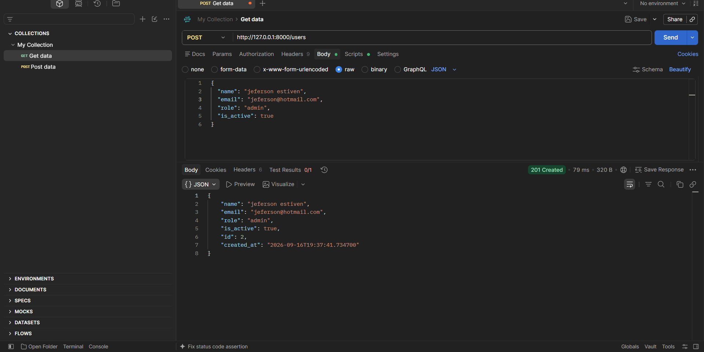

**Aprendiz:**jeferson estiven vargas
**Actividad:** GA1-220501096-01-AA1-EV09 — FastAPI con SQLAlchemy: Persistencia de Datos y CRUD sobre Base de Datos

---

## Descripción

`device_systems` evoluciona de la EV08 (CRUD en memoria) a la **v3.0**: los usuarios ahora se guardan en **SQLite** mediante **SQLAlchemy**, así que los datos sobreviven a un reinicio del servidor (`device_systems.db`).

La API expone `/users` con CRUD completo (`GET`, `POST`, `PUT`, `PATCH`, `DELETE`), ejecutando consultas reales contra la base de datos, con restricciones (`constraints`) definidas en el modelo.

## Tecnologías

| Tecnología | Uso |
|---|---|
| **FastAPI** | Framework de la API |
| **Uvicorn** | Servidor ASGI |
| **SQLAlchemy** | ORM (clases Python ↔ tablas SQL) |
| **SQLite** | Base de datos |
| **Pydantic v2** | Validación y serialización |
| **email-validator** | Valida formato de `EmailStr` |

## Instalación

```bash
git clone https://github.com/TU-USUARIO/device_systems.git
cd device_systems

python3 -m venv venv
source venv/bin/activate        # Windows: venv\Scripts\activate

pip install -r requirements.txt
```

## Ejecutar

```bash
uvicorn app.main:app --reload
```

- API: `http://127.0.0.1:8000`
- Swagger UI: `http://127.0.0.1:8000/docs`
- ReDoc: `http://127.0.0.1:8000/redoc`

Al arrancar, se crea automáticamente `device_systems.db` con la tabla `users` lista (no requiere scripts aparte).


## Estructura del proyecto

```
device_systems/
├── app/
│   ├── main.py                        ← arranca la app, crea las tablas
│   ├── database/connection.py         ← engine, SessionLocal, Base
│   ├── models/user_model.py           ← modelo SQLAlchemy (tabla "users")
│   ├── schemas/user_schema.py         ← UserCreate, UserUpdate, UserPatch, UserResponse
│   ├── routes/user_routes.py          ← endpoints CRUD
│   ├── services/user_service.py       ← lógica CRUD contra la BD
│   └── dependencies/
│       ├── database_dependency.py     ← get_db()
│       └── user_dependencies.py       ← get_user_or_404()
├── images/
├── requirements.txt
├── .gitignore
└── README.md
```

## Configuración de la base de datos

```python
DATABASE_URL = "sqlite:///./device_systems.db"

engine = create_engine(DATABASE_URL, connect_args={"check_same_thread": False})
SessionLocal = sessionmaker(autocommit=False, autoflush=False, bind=engine)
Base = declarative_base()
```

- **`engine`**: conexión hacia el archivo SQLite.
- **`SessionLocal`**: fábrica de sesiones (una por petición HTTP).
- **`Base`**: clase de la que heredan los modelos.

En `main.py`, `Base.metadata.create_all(bind=engine)` crea la tabla `users` leyendo `user_model.py`.

## Modelo SQLAlchemy vs. Schema Pydantic

Son dos clases distintas, con propósitos distintos:

| | Modelo (`user_model.py`) | Schema (`user_schema.py`) |
|---|---|---|
| Representa | Una tabla de la BD | La forma de los datos HTTP |
| Hereda de | `Base` (SQLAlchemy) | `BaseModel` (Pydantic) |
| Función | Guarda/consulta en SQLite | Valida y serializa JSON ↔ Python |
| Sabe de HTTP | No | Sí |
| Sabe de SQL | Sí (`Column`, `unique`, `nullable`) | No |
| Ejemplo | `email = Column(String, unique=True, nullable=False)` | `email: EmailStr` |

El modelo aplica reglas de *base de datos* (`unique`, `nullable`); el schema aplica reglas de *validación de entrada* (`EmailStr`, `Literal[...]`). El servicio conecta ambos: `user_service.crear_usuario()` recibe un diccionario validado (`UserCreate`) y crea un objeto `User` para guardarlo en la BD.

## Modelo SQLAlchemy (constraints)

```python
class User(Base):
    __tablename__ = "users"

    id = Column(Integer, primary_key=True, index=True)
    name = Column(String, nullable=False)
    email = Column(String, unique=True, nullable=False, index=True)
    role = Column(String, nullable=False)
    is_active = Column(Boolean, default=True)
    created_at = Column(DateTime, default=datetime.utcnow)
```

| Campo | Tipo | Restricción |
|---|---|---|
| `id` | `Integer` | `primary_key=True` |
| `name` | `String` | `nullable=False` |
| `email` | `String` | `unique=True, nullable=False` |
| `role` | `String` | `nullable=False` |
| `is_active` | `Boolean` | `default=True` |
| `created_at` | `DateTime` | `default=datetime.utcnow` |

## Endpoints

| Operación | Método | Ruta | Código esperado |
|---|---|---|---|
| Listar usuarios | GET | `/users` | `200 OK` |
| Filtrar/ordenar | GET | `/users?role=admin` / `?is_active=true` / `?order_by=name` | `200 OK` |
| Consultar usuario | GET | `/users/{user_id}` | `200 OK` / `404` |
| Crear usuario | POST | `/users` | `201` / `400` / `422` |
| Actualizar completo | PUT | `/users/{user_id}` | `200` / `404` / `400` |
| Actualizar parcial | PATCH | `/users/{user_id}` | `200` / `404` / `400` |
| Eliminar usuario | DELETE | `/users/{user_id}` | `200` / `404` |

## Schemas Pydantic

```python
class UserBase(BaseModel):
    name: str = Field(..., min_length=3)
    email: EmailStr
    role: Literal["admin", "support", "user"]
    is_active: bool = True

class UserCreate(UserBase): pass
class UserUpdate(UserBase): pass

class UserPatch(BaseModel):
    name: Optional[str] = None
    email: Optional[EmailStr] = None
    role: Optional[Literal["admin", "support", "user"]] = None
    is_active: Optional[bool] = None

class UserResponse(UserBase):
    id: int
    created_at: datetime
    model_config = ConfigDict(from_attributes=True)
```

`from_attributes=True` permite que `UserResponse` se construya directamente desde un objeto `User` (SQLAlchemy).

## Pruebas en Postman

### POST /users — creación exitosa (`201`)


### POST /users — correo duplicado (`400`)


### POST /users — datos inválidos (`422`)


### GET /users — listar todos


### GET /users/{id} — usuario inexistente (`404`)


### GET /users?role=... — filtrar por rol


### GET /users?is_active=true — filtrar por activos


### PUT /users/{id} — actualización completa (`200`)


### PATCH /users/{id} — actualización parcial (`200`)


### PATCH /users/{id} — sin campos enviados (`400`)


### DELETE /users/{id} — eliminación exitosa (`200`)


### DELETE /users/{id} — confirmación de borrado (`404` al volver a consultar)


## Códigos de estado

| Código | Cuándo se usa |
|---|---|
| `200 OK` | Operación exitosa (GET, PUT, PATCH, DELETE) |
| `201 Created` | Usuario creado (POST) |
| `400 Bad Request` | Correo duplicado, o PATCH sin campos |
| `404 Not Found` | Usuario no existe |
| `422 Unprocessable Entity` | Datos inválidos según Pydantic |

## Evidencia de las 11 pruebas (Fase 12), verificadas contra la BD real

| # | Prueba | Resultado |
|---|---|---|
| 1 | Crear usuario válido | `201`, con `id` y `created_at` de la BD |
| 2 | Crear con email repetido | `400` |
| 3 | Listar usuarios | `200`, 3 usuarios |
| 4 | Consultar por ID | `200` |
| 5 | Consultar ID inexistente | `404` |
| 6 | Filtrar por rol | `200`, solo el rol pedido |
| 7 | Filtrar por activos | `200`, solo `is_active=true` |
| 8 | Actualizar completo (PUT) | `200`, todos los campos reemplazados |
| 9 | Actualizar parcial (PATCH) | `200`, solo el campo enviado cambia |
| 10 | Eliminar usuario (DELETE) | `200` |
| 11 | Confirmar eliminación | `404` al volver a consultar |

## Errores controlados

| Escenario | Código | Respuesta |
|---|---|---|
| Usuario inexistente | `404` | `{"detail": "Usuario no encontrado"}` |
| Correo duplicado | `400` | `{"detail": "Ya existe un usuario registrado con el correo ..."}` |
| PATCH sin campos | `400` | `{"detail": "Debes enviar al menos un campo para actualizar"}` |
| Nombre corto / email inválido / rol no permitido | `422` | Error detallado de Pydantic por campo |

## Reflexión final
Pasar de una lista en memoria a una base de datos real con SQLAlchemy cambia por completo la confiabilidad de la API. En la EV08, cada reinicio del servidor borraba todos los usuarios: la API "olvidaba" todo lo que había pasado, lo cual es inaceptable para cualquier sistema real (un usuario no puede desaparecer solo porque el servidor se reinició por un despliegue o una caída). Con SQLite y SQLAlchemy, los datos quedan en device_systems.db y sobreviven a reinicios, actualizaciones de código e incluso a que el equipo se apague — que es, en el fondo, lo que un usuario final espera de cualquier aplicación: que su información no se pierda.

Trabajar con SQLAlchemy en lugar de una lista de Python se sintió más estructurado, pero también más exigente. Con una lista, cualquier validación (evitar correos duplicados, por ejemplo) había que programarla a mano recorriendo los elementos. Con SQLAlchemy, restricciones como unique=True o nullable=False quedan garantizadas por la propia base de datos, así que el motor rechaza automáticamente datos inválidos aunque el código de arriba tenga un error. A cambio, hay que pensar en sesiones (SessionLocal), en cuándo hacer commit/rollback, y en que cada petición HTTP debe abrir y cerrar su propia sesión — algo que con una lista en memoria simplemente no existía.